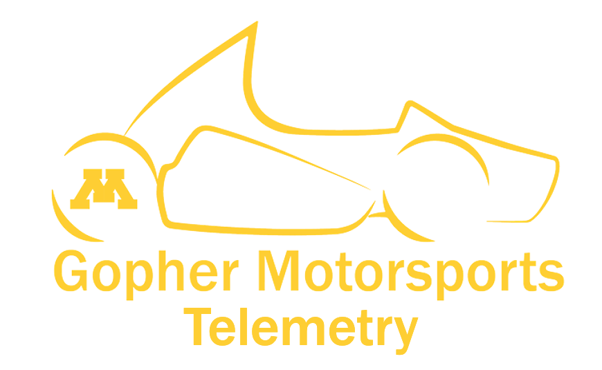

  
  <h1>Telemetry</h1>

  Realtime trackside telemetry system for <a href="[https://gophermotorsports.com">Gopher Motorsports</a> - UMN <a href="[url](https://www.fsaeonline.com/)">FSAE</a>

## Features

* Data streaming over XBee radio transmitter
* Storage and visualisation
* Built-in vehicle simulator

## Usage

### Trackside
[reciever.py](trackside/reciever.py) awaits a packet sent to a USB-connected XBee

### Simulation
[reciever.py](trackside/reciever.py) sends a packet to a USB-connected XBee

> **Note:** Some parameters may need changing depending on the name of the USB port.

## Description
The intended use of this package is for drive days and competition, by and for Gopher Motorsports - UMN FSAE. One [XBee](https://www.digi.com/xbee) radio transmitter is connected to the DLM within the vehicle. Data packets containing sensor information about the car is streamed to another XBee connected to a trackside computer. This package will parse the incoming bytes, store the data in [InfluxDB](https://www.influxdata.com/), and display the data in [Grafana](https://grafana.com/).

## Contributing 

Organizers
- [Henry O'Callaghan](https://github.com/hocally)
- [Nirbhay Vig](https://github.com/nirbhayvig)

Developers
- [Anton King](https://github.com/antonsking)
- [Sriram Nutulapati](https://github.com/Sriram212)
- [Erick Ti](https://github.com/erick-ti)

## Demo
Please watch our [video demo.](https://www.youtube.com/watch?v=CE0avbeNgHw)

## TODO

* [ ] Add all possible sensors to simulator
* [ ] Strengthen data parsing
* [ ] Dockerize
* [ ] Create python wheel

